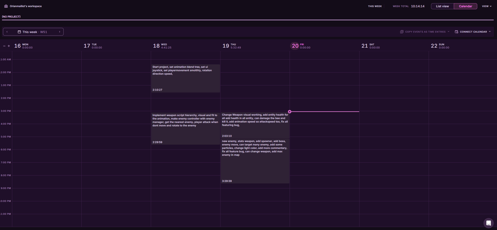

# 1. Introduction

This project is a test to evaluate my hard skills in Game Development and in
particular the following pillars : code **architecture**, code **readability**, code
**performance**, and **game feel**. The project must have 10 hours maxes of work.

 

# 2. Test approaching

## Before begin
First, I read all the technical test document and i imagine how can be the game, at the same time i download the unity version needed, and start to create a git project.
I see in the zip file that the project already made, with a .gitignore and some asset and prefab inside.

 

## On test started
When I start the project, I directly use **Toggl** to track my time work. *(Toggl Track is a time tracking software)*

 

### 1. Player Movement  
To start, I implemented the ***player movement***. This is the foundation for all future code structure, including **attack mechanics**, equipping a **weapon**, changing **statistics**, and **targeting an enemy**.  

It was a great starting point for me.  

I focused on making this system smooth and adaptable. I linked it with the **UIJoystick** to control movement speed, direction, and whether the player is moving or staying idle.  

> **Technical description:**  
> In the new Unity Input System, I configured various movement values using the **UIJoystick**. These values control the current speed and direction, with a range between 0 and 1.  
> This allows the player to move both slowly and quickly. By integrating this with an **animation blend tree**, the player’s movements feel much smoother! I also added small thresholds to avoid weird rotations, improving both movement and attack control.  

---
 

### 2. Weapon and Enemy  
Once the ***player movement*** was complete, I moved on to implementing the weapon and attack system. I started by creating a flexible weapon system with a well-structured hierarchy to support not just swords, but also **bows**, **guns**, **throwing objects**, and more.  

I made the system adaptable so that not only the player, but also enemies and other entities can use weapons. I also added a **weapon spawner**, allowing the player to pick up their first weapon.  

Next, I implemented a very basic enemy. I created a manager to control the number of enemies on the map, their positions, and their proximity distance to the player.  

With this setup, I was able to rotate the player to face the nearest enemy.  

Finally, I added a **health system** that can be applied to any entity.  
For example, if an enemy picks up a weapon and attacks the player, the system handles it seamlessly!  

---
 

### 3. Polishing and Making It Visually Fun  
Once everything was functional, I focused on testing, fixing bugs, and polishing the game. I added:  
- **More enemies**  
- **Particle effects**  
- **Code cleanup and comments**  

This final phase ensured the game felt more enjoyable and visually appealing.  

### Visuals  
Below is the screen of my toggl track used during this test :  

---
 

# 3. Time Spent on Each Phase  

- As you can see, I spent around ***two hours*** making a solid player movement system that works well with the animation and the **UI Joystick**. After these two hours, I didn't need to touch the movement code or animations again.  
 

- The ***weapon hierarchy*** took up most of my time. It was important to set it up correctly to save time later. On the other hand, the **enemy controller** and **manager**, including the logic to get the nearest enemy, didn't take much time to implement.  
 

- In the next phase, I revisited and improved the weapon code because I wasn’t satisfied with certain details. The changes were fast to implement. After that, I added several smaller features that dont take me much time, such as an **entity health system** to handle damage and death, and an **attack system** for swords with attack speed and animations.  
 

- In the final phase, I added more polish:
  - **Moving the enemy bee** for dynamism.  
  - Adding a **particle system**.  
  - Implementing a **static spawner** with additional enemies.  

  Most of these smaller features didn’t take much time. However, revising the weapon pickup system consumed the most time due to various bugs and the need to rethink the **weapon script's spawner and visual**.  
 

To finish, I was comfortable with this project. I relearned some features and discovered new ones, like **UI Joystick control**, which was pretty fun!  

# 4. Main Challenges  

There were several aspects of the project that took significant time and posed challenges. Here they are in order of difficulty:  

1. **UIJoystick**:  
   The joystick controls the player’s speed and direction and needed to move dynamically to the player’s click position. It also had to align perfectly with the visual representation. This was clearly the hardest part of the project.  

2. **Weapon Hierarchy**:  
   I wanted the hierarchy to be as clear and modular as possible. Since weapons are one of the main mechanics in the game, it was crucial to ensure this system worked seamlessly. Matching it with the visuals also added complexity.  

3. **Weapon Visuals**:  
   The in-game weapon visuals and the actual weapon functionality are linked but perform different tasks. Integrating the two systems without bugs and ensuring they worked perfectly together required a lot of effort.  

4. **Polishing Attacks**:  
   The attack system relies on animations, combined with particle effects and line visualizations. However, when switching abruptly between animations (e.g., from attacking to running), some attack visuals would not disappear correctly, causing visual glitches.  

> **Summary:**  
> The ***UIJoystick*** was the most time-consuming and challenging task. However, once completed, it didn’t require further adjustments. In contrast, the ***weapon code*** was frequently updated as it is the game’s main mechanic, making it reasonable to spend extra time refining it.

# 5. Areas for Improvement  

I believe there are many areas for improvement, as some mechanics were created quickly due to time constraints. Here they are, listed in order:  

1. **EnemyController**:  
   I created a simple **EnemyController** that just makes enemies run towards the player. Ideally, the system could be expanded like the weapon hierarchy, allowing for multiple types of enemies with different attacks and behaviors. However, for testing purposes, it works fine with varying health, speed, and size.  

2. **Weapon Visuals**:  
   The weapon visuals work well for a prototype, but I believe there are different ways to approach this. I could introduce a choice of weapon visuals and follow a more defined **artistic direction** to make it visually cohesive.  

3. **Polishing Visuals**:  
   I added some particle effects and line renderers to enhance the visuals. While the visuals are not perfect, they work and are understandable. More time could be spent refining these to improve the overall aesthetic.  

4. **Camera and Enemy Spawn**:  
   The camera’s distance and rotation could be improved for better control and visibility. Perhaps using an **isometric view** would be more effective. Additionally, the enemy spawner could be more dynamic—maybe spawning enemies in waves, and instead of static positions in a circle, they could spawn around the player at varying distances and offsets, depending on the resolution.  

> **Summary:**  
> There are many areas for improvement, but I’m proud of the work I’ve done. The game works well, and it provides a strong foundation to build a polished and engaging game. Many of the improvements are focused on polishing existing mechanics and adding additional features to enhance the overall experience.

# 6. Future Vision  

If the game were to continue development, here are the steps I would take to turn this prototype into a full-fledged game:

1. **Define the Objective and Game Loop**:  
   The core mechanics should revolve around player movement, attacking, changing weapons, and defeating enemies. Based on these mechanics, we could design for exemple a survival game. The game loop could look like this:  
   - Spawn enemies  
   - Collect weapons  
   - Defeat enemies  
   - Upgrade skills or weapons  
   - Fight stronger enemies  
   - Survive the horde or die (and repeat)  

2. **Develop Features for Maximum Freedom**:  
   To enhance the gameplay experience, we need to expand the variety of enemies, weapons, and upgrades. A strong sense of **progression** and **improvement** is crucial for player engagement. Features like leveling up, weapon upgrades, and additional power-ups will add more depth and keep the game rewarding.  

3. **Conduct Playtesting**:  
   Playtesting is essential to understand how players interact with the game. It's important to see what players enjoy, what they dislike, and how they feel while playing. Observing their reactions will help identify areas of improvement and refine the gameplay experience.  

4. **Adjust or Add Features Based on Feedback**:  
   Based on playtest results, we can refine or introduce new features to improve the overall player experience. By analyzing player feedback, we can tweak gameplay mechanics, visuals, and other aspects to enhance the emotional engagement and overall enjoyment.  

5. **Continue Development with a Clear Vision**:  
   The development process should remain focused on a well-defined end goal. This includes creating documentation, maintaining clear communication, and performing regular tests to ensure the game stays on track towards the desired final version.

# 7. To Finish  

> This technical test was really enjoyable, and I’m proud of the work I’ve done. It reflects my skills well. I’ve always enjoyed RPG games, and developing one too ! There were several challenges along the way, as well as valuable lessons learned, which will help me improve my game programming skills. I hope the game is appreciated! :D  
> Thank you for taking the time to read! :)
